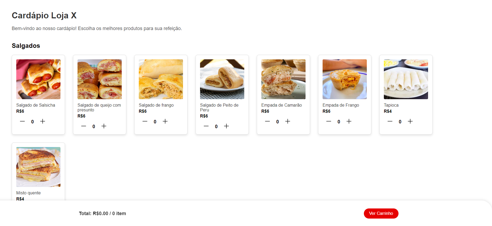

<br />
<div align="center">
  <a href="https://github.com/giovannibragasv/Unifood">
    
  </a>

<h3 align="center">uniFood</h3>

  <p align="center">
    Projeto criado de universitário, para universitário, em que será realizada a criação de aplicativos para realizar pedidos em lanchonetes universitárias. 
    <br />
    <br />
    Com foco na conveniência e agilidade, o projeto busca melhorar a experiência do usuário, otimizar o tempo dos estudantes e alinhar-se com a crescente digitalização de serviços financeiros em ambientes educacionais. 
    <br />
    <br />
  </p>
</div>


<details>
  <summary>Conteúdos</summary>
  <ol>
    <li>
      <a href="#sobre-o-projeto">Sobre o Projeto</a>
      <ul  
        <li><a href="#feito-com">Feito Com</a></li>
      </ul>
    </li>
    <li>
      <a href="#iniciando">Iniciando</a>
      <ul>
        <li><a href="#pré-requisitos">Pré-Requisitos</a></li>
        <li><a href="#instalação">Instalação</a></li>
      </ul>
    </li>
    <li><a href="#utilização">Utilização</a></li>
    <li><a href="#créditos">Créditos</a></li>
  </ol>
</details>

<!-- ABOUT THE PROJECT -->
## Sobre o projeto



Projeto criado por 3 alunos universitários realizando a matéria de Engenharia de Software, ministrada pelo professor Ricardo Rodrigo, como aprendizado sobre PBB, Scrum, dentre outros. Idealizado e desenvolvido no Centro Universitário do Pará.


### Feito com

* 
* 
* 


## Iniciando

Para iniciar o projeto na sua máquina local, siga os passos a seguir

### Pré-Requisitos

Para utilizar o projeto, utilizamos e recomendamos a IDE Visual Studio Code, e a utilização da extensão Live Server para ver o projeto que está sendo desenvolvido

### Instalação

1. Clonar o repo
   ```sh
   git clone https://github.com/giovannibragasv/unifood.git
   ```
2. Ligar o live server

## Utilização

Esse projeto poderá ser utilizado por toda e qualquer lanchoente de universidade que queira implementar a tecnologia no seu dia a dia, otimizando grandemente seu trabalho.
<br />

## Créditos

Projeto desenvolvido e idealizado por
* Antônio Heitor Gomes Azevedo (Scrum Master)
* Cauã Maia de Souza Nara (Product Owner)
* Giovanni Braga Soares Vasconcelos (Developer)
